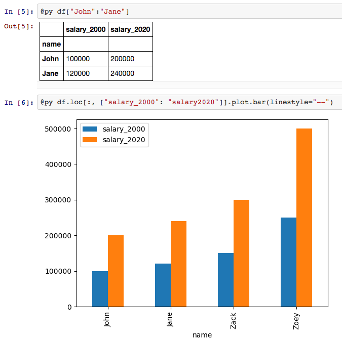

# PySyntax [](https://travis-ci.org/kdheepak/PySyntax.jl) [](https://ci.appveyor.com/project/kdheepak/pysyntax-jl)

** This package is deprecated [JuliaLang/julia/issues/1974](https://github.com/JuliaLang/julia/issues/1974) has been merged and this dot-overloading functionality has since been implemented in PyCall.jl with https://github.com/JuliaPy/PyCall.jl/commit/e4035b83148b296ddef0804177a970cf826dcd8d **

Python-like syntax in [Julia](https://github.com/JuliaLang/julia). PySyntax.jl provides a light wrapper on top of [PyCall.jl](https://github.com/JuliaPy/PyCall.jl) in the form of a macro.



### Installation

Within Julia, just use the package manager to run `Pkg.clone("https://github.com/kdheepak/PySyntax.jl")` to install the files.
Julia 0.5 or later is recommended.

### Usage

In a session, type the following to export the `@py` macro.

```julia
using PySyntax
```

The `@py` macro allows Python-like syntax

```julia
@pyimport pandas as pd
df = pd.DataFrame(
    Dict(
        "name"=>["John", "Jane", "Zack", "Zoey"],
        "salary"=>[100000, 100000, 100000, 100000]
        )
)
@py df = df.set_index("name")
@py df["John":"Jane"]
```

See [notebooks](./notebooks/PySyntax.jl.ipynb) for examples. See [JuliaPy/PyCall.jl#86](https://github.com/JuliaPy/PyCall.jl/issues/86) for the discussion on this subject.

Improvements, suggestions or contributions welcome!

